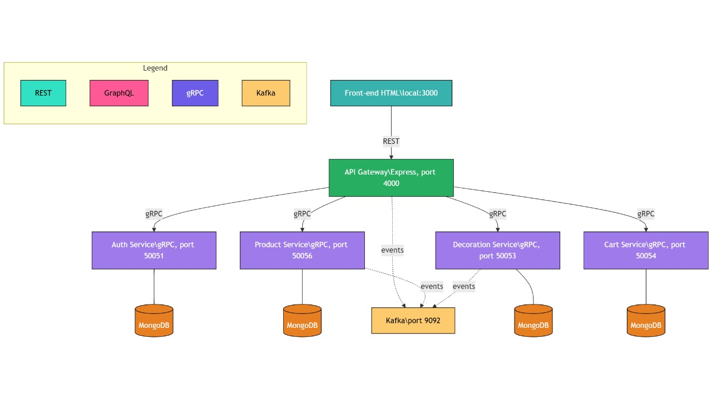
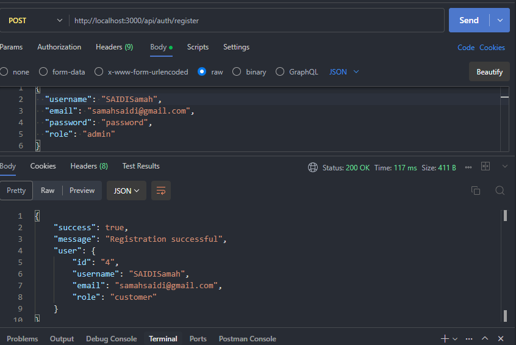
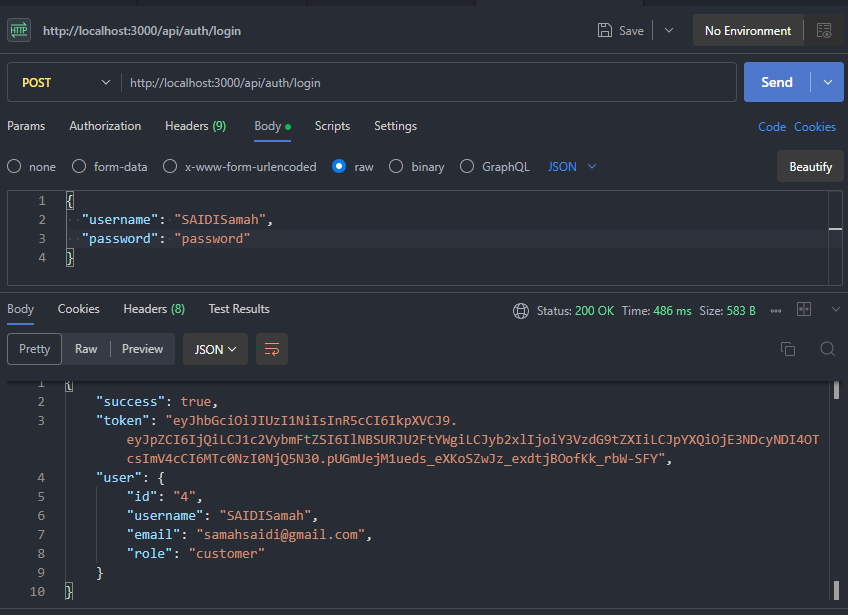

# Projet Décoration SOA – Microservices

## Présentation du projet

Ce projet vise à démontrer une architecture microservices moderne pour la gestion d'une boutique de produits de décoration. Il met en œuvre plusieurs services indépendants (authentification, gestion des produits, gestion du panier, gestion des articles de décoration) qui communiquent entre eux via gRPC et échangent des événements asynchrones via Kafka. L'ensemble est orchestré par une API Gateway qui centralise les accès (REST et GraphQL) et applique la sécurité (JWT). Chaque service dispose de sa propre base de données MongoDB, ce qui garantit l'indépendance et la scalabilité. Un front-end de test permet de valider les fonctionnalités principales.

## Sommaire
- [Présentation](#présentation)
- [Architecture](#architecture)
- [Prérequis](#prérequis)
- [Installation](#installation)
- [Démarrage des services](#démarrage-des-services)
- [Utilisation du front de test](#utilisation-du-front-de-test)
- [Tests Kafka](#tests-kafka)
- [Tests Authentification](#tests-authentification)
- [Dépannage](#dépannage)
- [Auteurs](#auteurs)
- [Exemples de requêtes Postman](#exemples-de-requêtes-postman)

---

## Présentation

Ce projet est une application de démonstration d'architecture microservices pour la gestion de produits de décoration.  
Il utilise :
- **Node.js** pour les microservices
- **gRPC** pour la communication inter-services
- **Kafka** pour la gestion d'événements asynchrones
- **MongoDB** pour la persistance
- **API Gateway** pour centraliser les appels
- **Front-end HTML/JS** pour tester les fonctionnalités

> Remarque : Les outils CI/CD, Docker, Kubernetes et le monitoring ne sont pas inclus dans cette version du projet. L'architecture présentée correspond aux composants effectivement développés et utilisés dans ce projet.

---

## Architecture

### Vue d'ensemble



### Composants Principaux

#### 1. API Gateway (Port 4000)
- **Technologies**: Express.js, Apollo Server, GraphQL
- **Fonctionnalités**:
  - Point d'entrée unique pour tous les clients
  - Support REST et GraphQL
  - Gestion de l'authentification
  - Routage des requêtes vers les microservices
  - Publication d'événements Kafka
  - Validation des tokens JWT
  - Gestion des erreurs centralisée

#### 2. Services Microservices (gRPC)

##### Auth Service (Port 50051)
- **Fonctionnalités**:
  - Inscription utilisateur
  - Connexion
  - Validation de token
  - Gestion des rôles (admin/client)
- **Sécurité**: JWT
- **Base de données**: MongoDB
- **Événements**: Publication des événements d'authentification

##### Cart Service (Port 50054)
- **Fonctionnalités**:
  - Ajout au panier
  - Suppression du panier
  - Consultation du panier
  - Gestion des quantités
  - Calcul du total
- **Stockage**: MongoDB
- **Événements**: Publication des événements de panier

##### Product Service (Port 50056)
- **Fonctionnalités**:
  - CRUD produits
  - Recherche de produits
  - Gestion des catégories
  - Filtrage par prix
  - Gestion des stocks
- **Base de données**: MongoDB
- **Événements**: Publication des événements de produits

##### Decoration Service (Port 50053)
- **Fonctionnalités**:
  - CRUD articles de décoration
  - Filtrage par style et matériau
  - Filtrage par gamme de prix
  - Gestion des dimensions
  - Gestion des couleurs
- **Base de données**: MongoDB
- **Événements**: Publication des événements de décoration

#### 3. Système d'Événements (Kafka)
- **Port**: 9092
- **Topics**:
  - `gateway_events`: Événements généraux de l'API Gateway
  - `product_events`: Événements liés aux produits
  - `decoration_events`: Événements liés aux articles de décoration
  - `auth_events`: Événements d'authentification
  - `cart_events`: Événements liés au panier

### Flux de Communication

1. **Flux d'Authentification**
```
Client → API Gateway → Auth Service → MongoDB
                      ↓
                  Kafka Events (auth_events)
```

2. **Flux de Gestion des Produits**
```
Client → API Gateway → Product Service → MongoDB
                      ↓
                  Kafka Events (product_events)
```

3. **Flux de Gestion du Panier**
```
Client → API Gateway → Cart Service → MongoDB
                      ↓
                  Kafka Events (cart_events)
```

4. **Flux de Gestion de la Décoration**
```
Client → API Gateway → Decoration Service → MongoDB
                      ↓
                  Kafka Events (decoration_events)
```

### Sécurité
- Authentification basée sur JWT
- Contrôle d'accès basé sur les rôles (admin/client)
- Gestion sécurisée des mots de passe (hachage bcrypt)
- Middleware de validation des tokens
- **openRoutes** : certaines routes (ex : `/auth/login`, `/auth/register`) sont accessibles sans authentification pour permettre l'inscription et la connexion des utilisateurs.
- Protection contre les injections
- Validation des entrées
- Rate limiting
- CORS configuré

### openRoutes (Routes publiques)

Certaines routes de l'API Gateway sont accessibles sans authentification (openRoutes), comme `/auth/login` et `/auth/register`.  
Elles permettent à un utilisateur de s'inscrire ou de se connecter sans avoir déjà un token JWT.  
Dans le code, ces routes sont listées dans un tableau `openRoutes` et le middleware d'authentification les laisse passer sans vérification de token.

**Exemples de routes publiques** :
- `POST /auth/login`
- `POST /auth/register`

Toutes les autres routes nécessitent un token JWT valide.

### Composants de Test
- Interface frontend de test (Port 3000)
- Tests des messages Kafka
- Test d'authentification
- Test des API REST via Postman
- Tests GraphQL via Apollo Studio
- Tests de charge avec Artillery

---

## Prérequis

- **Node.js** (v18+ recommandé)
- **npm**
- **MongoDB** (en local ou distant)
- **Kafka** (en local ou via Docker)
- **git** (pour cloner le projet)

---

## Installation

1. **Clone le projet**
   ```bash
   git clone <url-du-repo>
   cd ProjetDecoration_SOA
   ```

2. **Installe les dépendances pour chaque service**
   ```bash
   cd auth-service
   npm install
   cd ../product-service
   npm install
   cd ../decoration-service
   npm install
   cd ..
   cd api-gateway
   npm install
   ```

3. **Vérifie que MongoDB et Kafka sont démarrés**

---

## Démarrage des services

Dans différents terminaux :

1. **Auth Service**
   ```bash
   cd auth-service
   node authMicroservice.js
   ```

2. **Product Service**
   ```bash
   cd product-service
   node productMicroservice.js
   ```

3. **Decoration Service**
   ```bash
   cd decoration-service
   node decorationMicroservice.js
   ```

4. **API Gateway**
   ```bash
   cd api-gateway
   node apiGateway.js
   ```

5. **Front-end de test (Kafka & Auth)**
   ```bash
   cd decoration-service
   node server.js
   ```
   Accède ensuite à [http://localhost:3000](http://localhost:3000)

---

## Utilisation du front de test

- **Section Kafka** :  
  Permet d'envoyer des messages sur les topics Kafka et de voir les messages reçus en temps réel via WebSocket.

- **Section Authentification** :  
  Permet de tester l'inscription (`/auth/register`) et la connexion (`/auth/login`) via l'API Gateway.

---

## Tests Kafka

1. Sélectionne un topic (gateway_events, product_events, decoration_events)
2. Renseigne le type de message et le contenu (en JSON)
3. Clique sur « Envoyer le message »
4. Les messages reçus s'affichent en temps réel

---

## Tests Authentification

1. Renseigne un email et un mot de passe
2. Clique sur « S'inscrire » pour tester l'inscription
3. Clique sur « Se connecter » pour tester la connexion
4. Le résultat s'affiche sous les boutons

---

## Dépannage

- **Erreur EADDRINUSE** :  
  Un port est déjà utilisé.  
  → Trouve le PID avec `netstat -ano | findstr :<port>` puis tue-le avec `taskkill /PID <PID> /F`.

- **Erreur JSON ou page HTML reçue** :  
  Vérifie que l'API Gateway tourne bien sur le port 4000 et que les routes `/auth/register` et `/auth/login` existent.

- **Kafka ne reçoit pas de messages** :  
  Vérifie que le broker Kafka tourne sur le port 9092.

- **MongoDB non connecté** :  
  Vérifie que le service MongoDB est bien démarré.

---

## Exemples de requêtes Postman

### 1. Authentification (Register & Login)

#### Inscription (Register)
- **URL** : `POST http://localhost:4000/auth/register`
- **Body (JSON)** :
```json
{
  "email": "test@example.com",
  "password": "monmotdepasse"
}
```
- **Réponse attendue** :
```json
{
  "success": true,
  "message": "Utilisateur enregistré avec succès"
}
```



#### Connexion (Login)
- **URL** : `POST http://localhost:4000/auth/login`
- **Body (JSON)** :
```json
{
  "email": "test@example.com",
  "password": "monmotdepasse"
}
```
- **Réponse attendue** :
```json
{
  "success": true,
  "token": "<JWT>"
}
```



### 2. Envoi d'un message Kafka via l'API Gateway (si exposé)
- **URL** : `POST http://localhost:3000/send-message`
- **Body (JSON)** :
```json
{
  "topic": "gateway_events",
  "type": "TEST_EVENT",
  "content": { "message": "Ceci est un test" }
}
```
- **Réponse attendue** :
```json
{
  "success": true,
  "message": "Message envoyé avec succès",
  "data": {
    "topic": "gateway_events",
    "type": "TEST_EVENT",
    "content": { "message": "Ceci est un test" },
    "timestamp": "..."
  }
}
```

---

**N'hésite pas à adapter ce README à tes besoins spécifiques !**
Si tu veux un schéma d'architecture graphique ou des exemples de requêtes, demande-moi ! 

## 📜 Auteur

👤 Samah Saidi

4Info - Classe DS1

📧 Contact: samah.saidi@polytechnicien.tn

🔗 GitHub: https://github.com/samah-saidi
