# 📚 TP2 : Création d'une API RESTful avec Express JS

Ce TP a pour objectif de créer une API RESTful en utilisant **Express JS** et **SQLite3**. L'API permet de gérer une base de données de personnes avec des opérations CRUD (Create, Read, Update, Delete). Optionnellement, l'API peut être sécurisée avec **Keycloak** pour l'authentification OAuth 2.0.

---

## 📋 Table des Matières

1. [Objectifs](#objectifs)
2. [Technologies Utilisées](#technologies-utilisées)
3. [Étapes du TP](#étapes-du-tp)
4. [Routes de l'API](#routes-de-lapi)
5. [Tests avec Postman](#tests-avec-postman)
6. [Sécurisation avec Keycloak (Optionnel)](#sécurisation-avec-keycloak-optionnel)
7. [Auteurs](#auteurs)

---

## 🎯 Objectifs

✅ Créer une API REST avec **Express JS**.
✅  Utiliser les bonnes pratiques pour les API RESTful.
✅  Gérer une base de données avec **SQLite3**.
✅  Optionnel : Sécuriser l'API avec **Keycloak**.

---

## 🛠 Technologies Utilisées

-🟢 **Node.js** : Environnement d'exécution JavaScript.
- ⚡**Express JS** : Framework pour structurer l'API.
- 🗄️**SQLite3** : Base de données légère et embarquée.
- 🔐**Keycloak** (Optionnel) : Solution d'authentification OAuth 2.0.
- 🛠️**Postman** : Outil de test des endpoints de l'API.

---

## 🚀 Étapes du TP

###  1️⃣ **Initialisation du Projet**

1. Créez un dossier pour votre projet.
2. Initialisez un projet Node.js :

```bash
   npm init -y
```

3.Installez les dépendances :

```bash
    npm install express sqlite3
```

###  2️⃣  **Configuration de SQLite3**
📄 Créer database.js et ajouter :
```JavaScript
    const sqlite3 = require('sqlite3').verbose();

    const db = new sqlite3.Database('./maBaseDeDonnees.sqlite', sqlite3.OPEN_READWRITE | sqlite3.OPEN_CREATE, (err) => {
    if (err) console.error(err.message);
    else {
        console.log('Connecté à la base de données SQLite.');
        db.run(`
        CREATE TABLE IF NOT EXISTS personnes (
            id INTEGER PRIMARY KEY AUTOINCREMENT,
            nom TEXT NOT NULL
        )
        `, (err) => {
        if (err) console.error(err.message);
        else {
            // Insertion de données initiales
            const personnes = ['Bob', 'Alice', 'Charlie'];
            personnes.forEach((nom) => {
            db.run(`INSERT INTO personnes (nom) VALUES (?)`, [nom]);
            });
        }
        });
    }
    });

    module.exports = db;
```
3️⃣ Création de l'API avec Express
📄 Créer index.js et ajouter :

```JavaScript 
    const express = require('express');
const session = require('express-session');
const Keycloak = require('keycloak-connect');
const db = require('./database');
const app = express();
app.use(express.json());
const PORT = 3000;

// Session configuration for Keycloak
const memoryStore = new session.MemoryStore();
app.use(session({
  secret: 'api-secret',
  resave: false,
  saveUninitialized: true,
  store: memoryStore
}));

// Keycloak configuration
const keycloak = new Keycloak({ store: memoryStore }, './keycloak-config.json');
app.use(keycloak.middleware());

// Root endpoint
app.get('/', (req, res) => {
  res.json("Registre de personnes! Choisissez le bon routage!")
});

// Secure endpoint example
app.get('/secure', keycloak.protect(), (req, res) => {
  res.json({ message: 'Vous êtes authentifié !' });
});

// Get all persons - protected by Keycloak
app.get('/personnes', keycloak.protect(), (req, res) => {
  db.all("SELECT * FROM personnes", [], (err, rows) => {
    if (err) {
      res.status(400).json({
        "error": err.message
      });
      return;
    }
    res.json({
      "message": "success",
      "data": rows
    });
  });
});

// Get person by ID - protected by Keycloak
app.get('/personnes/:id', keycloak.protect(), (req, res) => {
  const id = req.params.id;
  db.get("SELECT * FROM personnes WHERE id = ?", [id], (err, row) => {
    if (err) {
      res.status(400).json({
        "error": err.message
      });
      return; 
    }
    if (!row) {
      res.status(404).json({
        "message": "Person not found"
      });
      return;
    }
    res.json({
      "message": "success",
      "data": row 
    });
  });
});

// Create a new person - protected by Keycloak
app.post('/personnes', keycloak.protect(), (req, res) => {
  const { nom, adresse } = req.body;
  if (!nom) {
    res.status(400).json({
      "error": "Name is required"
    });
    return;
  }
  
  db.run(`INSERT INTO personnes (nom, adresse) VALUES (?, ?)`, [nom, adresse || null], function(err) {
    if (err) {
      res.status(400).json({
        "error": err.message
      });
      return; 
    }
    res.status(201).json({
      "message": "success",
      "data": {
        id: this.lastID 
      }
    });
  });
});

// Update a person - protected by Keycloak
app.put('/personnes/:id', keycloak.protect(), (req, res) => {
  const id = req.params.id;
  const { nom, adresse } = req.body;
  
  // First check if the person exists
  db.get("SELECT * FROM personnes WHERE id = ?", [id], (err, row) => {
    if (err) {
      res.status(400).json({
        "error": err.message
      });
      return;
    }
    if (!row) {
      res.status(404).json({
        "message": "Person not found"
      });
      return;
    }
    
    // If the person exists, update their information
    const nomToUpdate = nom || row.nom;
    const adresseToUpdate = adresse !== undefined ? adresse : row.adresse;
    
    db.run(`UPDATE personnes SET nom = ?, adresse = ? WHERE id = ?`, 
           [nomToUpdate, adresseToUpdate, id], function(err) {
      if (err) {
        res.status(400).json({
          "error": err.message
        });
        return; 
      }
      
      if (this.changes === 0) {
        res.status(404).json({
          "message": "No person found with that ID"
        });
        return;
      }
      
      res.json({
        "message": "success",
        "changes": this.changes
      });
    });
  });
});

// Delete a person - protected by Keycloak
app.delete('/personnes/:id', keycloak.protect(), (req, res) => {
  const id = req.params.id;
  
  db.run(`DELETE FROM personnes WHERE id = ?`, id, function(err) {
    if (err) {
      res.status(400).json({
        "error": err.message
      });
      return;
    }
    
    if (this.changes === 0) {
      res.status(404).json({
        "message": "No person found with that ID"
      });
      return;
    }
    
    res.json({
      "message": "success",
      "changes": this.changes
    });
  });
});

// Start the server
app.listen(PORT, () => {
  console.log(`Server running on port ${PORT}`);
});

```
4️⃣ Modification de la Base de Données
Ajout d'une colonne adresse :
```JavaScript
    db.run(`CREATE TABLE IF NOT EXISTS personnes (
    id INTEGER PRIMARY KEY AUTOINCREMENT,
    nom TEXT NOT NULL,
    adresse TEXT
    )`);
```

5️⃣ 🧪 Tests avec Postman
🌐 Routes de l'API

🔹 GET /personnes → Récupérer toutes les personnes


🔹 GET /personnes/1 → Récupérer la personne d'ID 1
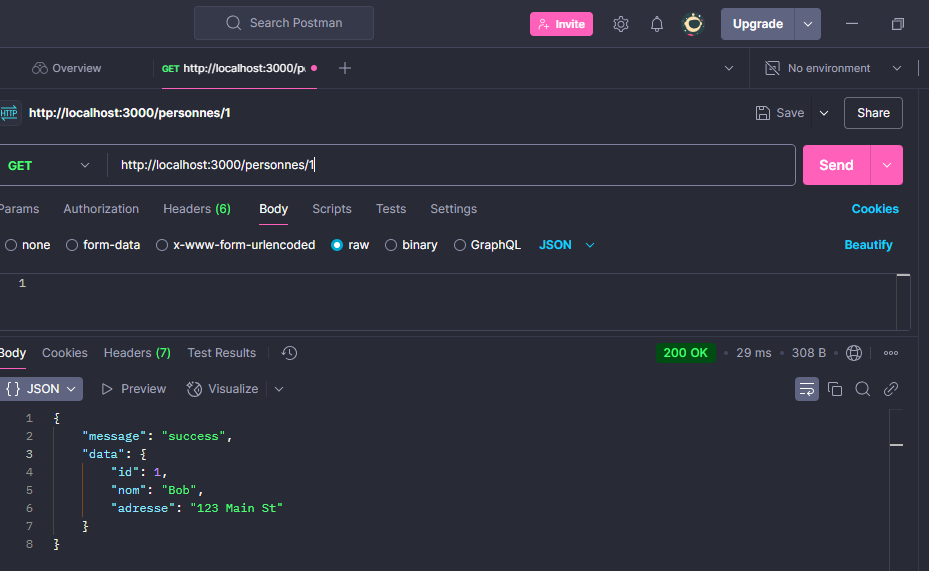

🔹 GET /personnes/1 → Récupérer la personne d'ID 2
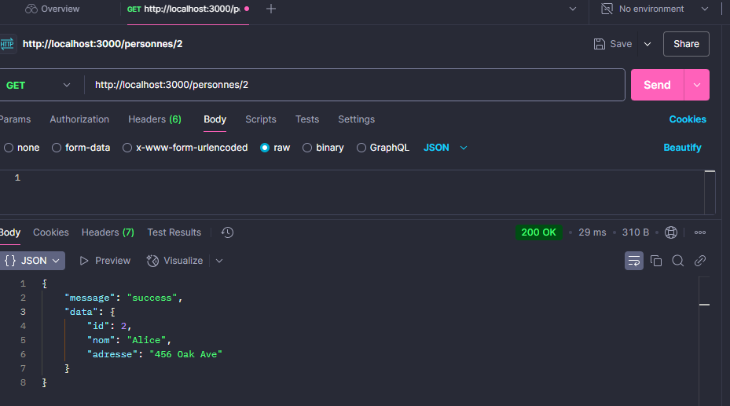

🔹 GET /personnes/1 → Récupérer la personne d'ID 3
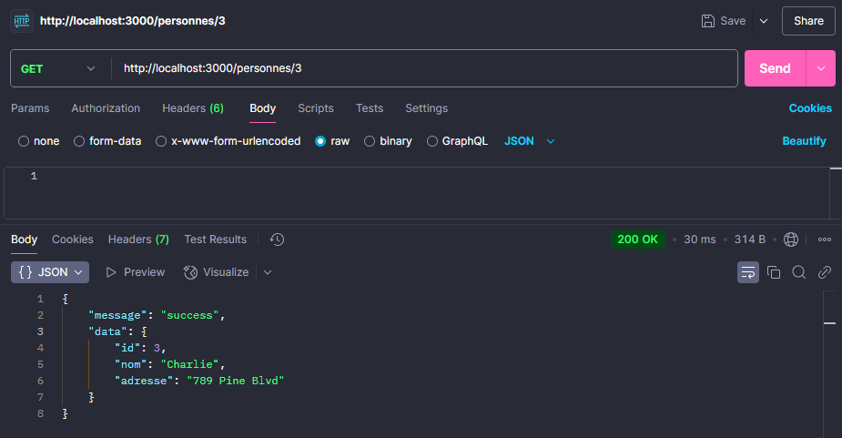

🔹 GET /personnes/1 → Récupérer la personne d'ID 10 → message d'erreur "personne n'est pas trouvable "
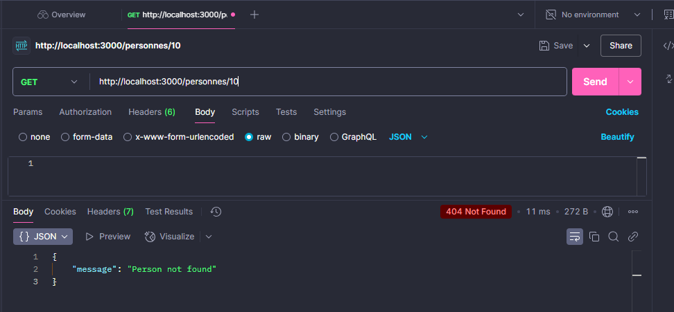 

🔹 POST /personnes → Ajouter une personne { "nom": "samah", "adresse": "mednine" }
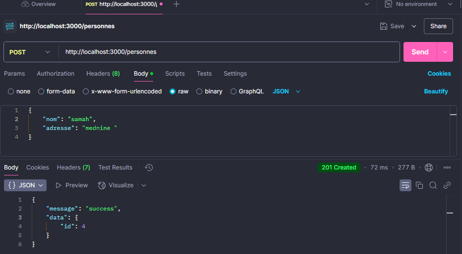 

🔹 PUT /personnes/1 → Modifier { "nom": "samah SAIDI", "adresse": "Djerba" } / { "nom": "samah " }
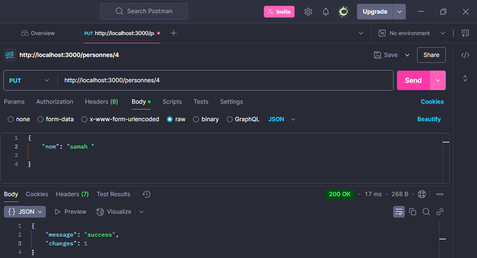
 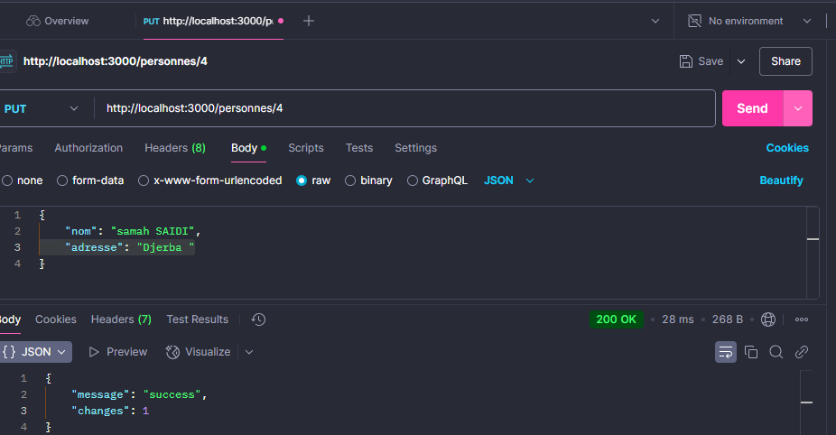 

🔹 DELETE /personnes/1 → Supprimer une personne
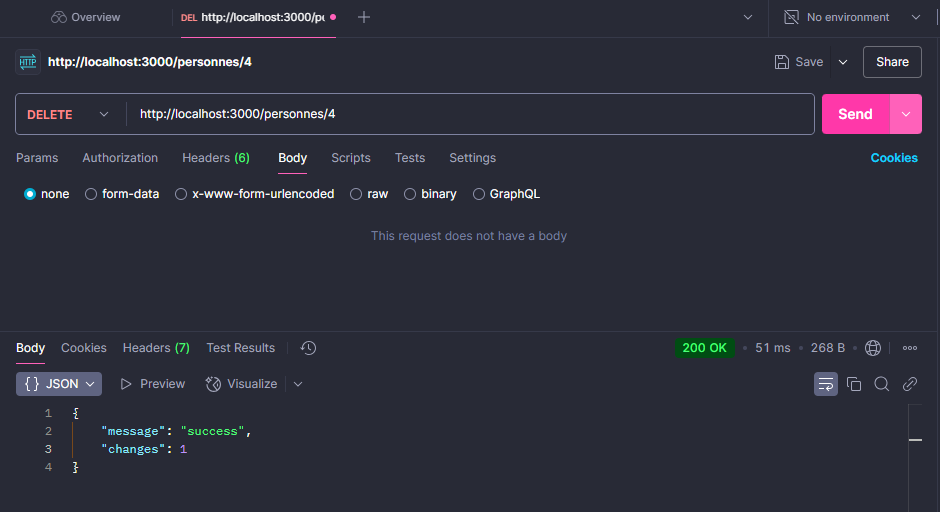


6️⃣ (🔐 Optionnel) Authentification avec Keycloak
1. Installation :
```bash
    npm install keycloak-connect
```
2. Configuration Keycloak :
Créer un fichier de configuration Keycloak, par exemple keycloak-config.json, 
contenant :

```bash
{
    "realm": "api-realm",
    "auth-server-url": "http://localhost:8080/auth",
    "ssl-required": "external",
    "resource": "pai-id",
    "credentials": 
    {
    "secret": "api-secret"
    },
    "confidential-port": 0
}
```
3. Ajouter Keycloak dans votre API : Modifiez index.js pour inclure Keycloak :
```bash
    const session = require('express-session');
    const Keycloak = require('keycloak-connect');
    const memoryStore = new session.MemoryStore();
    app.use(session(
        {
    secret: 'api-secret', 
    resave: false,
    saveUninitialized: true,
    store: memoryStore
    }));
    // Configuration de Keycloak
    const keycloak = new Keycloak({ store: memoryStore }, './keycloak-config.json');
    app.use(keycloak.middleware());
    // Exemple : Protéger une route avec Keycloak
    app.get('/secure', keycloak.protect(), (req, res) => {
    res.json({ message: 'Vous êtes authentifié !' });
    });

```
4. Pour sécuriser les autres routes, utilisez keycloak.protect() ::
```bash
    // Exemple de sécurisation d'une route existante
    app.get('/personnes', keycloak.protect(), (req, res) => 
    {
    db.all("SELECT * FROM personnes", [], (err, rows) => {
    if (err) {
    res.status(400).json({ "error": err.message });
    return;
    }
    res.json({ "message": "success", "data": rows });
    });
    });
```
5. Configurez Keycloak :
Créez un fichier keycloak-config.json avec les paramètres de votre realm et client Keycloak.

6. 🧪 Tester avec Postman :

Ajoutez un token JWT dans les en-têtes des requêtes pour accéder aux routes sécurisées.

🔹 POST : http://localhost:8080/auth/realms/api-realm/protocol/openid-connect/token
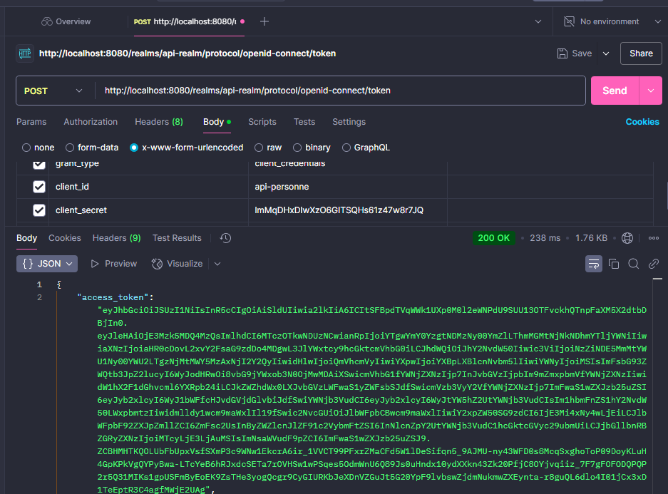

🔹 GET /personnes
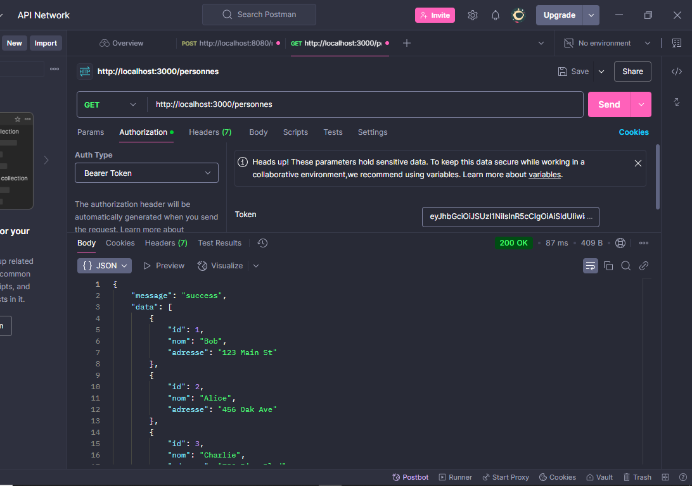
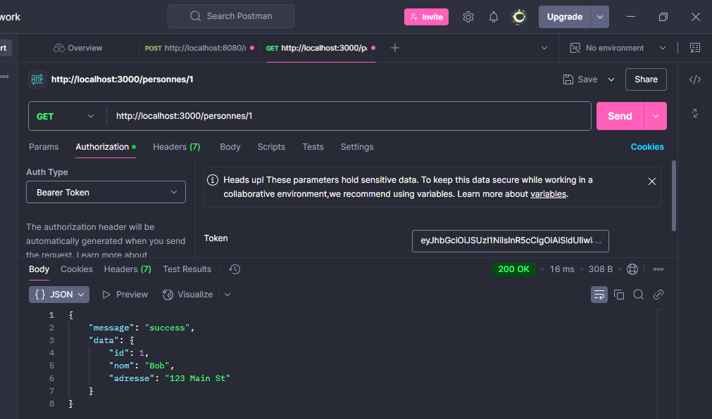
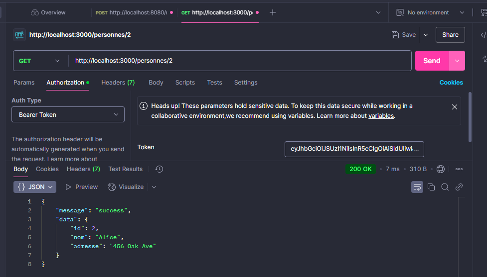
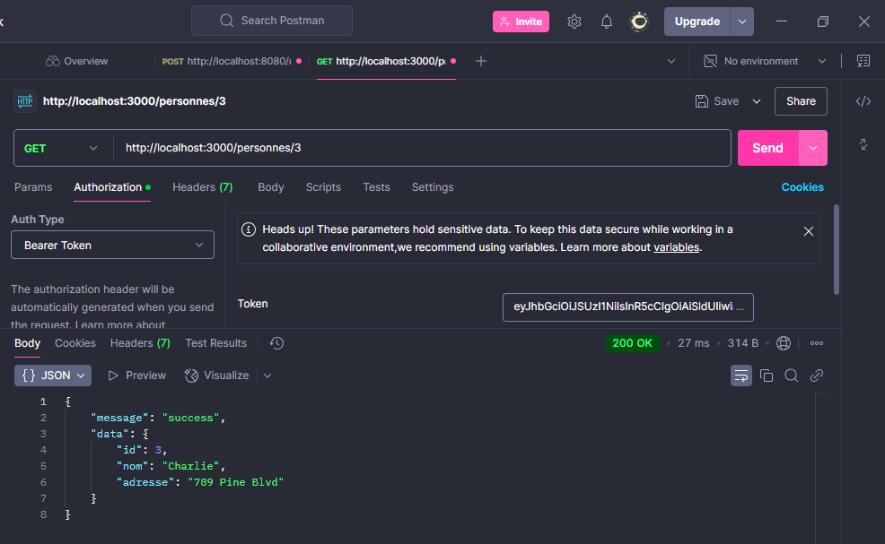
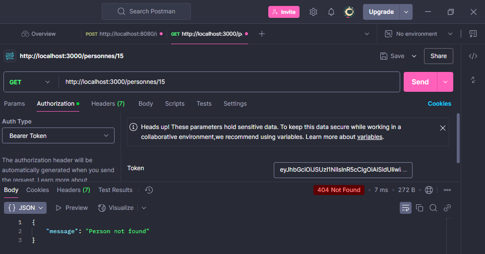
🔹 POST /personnes
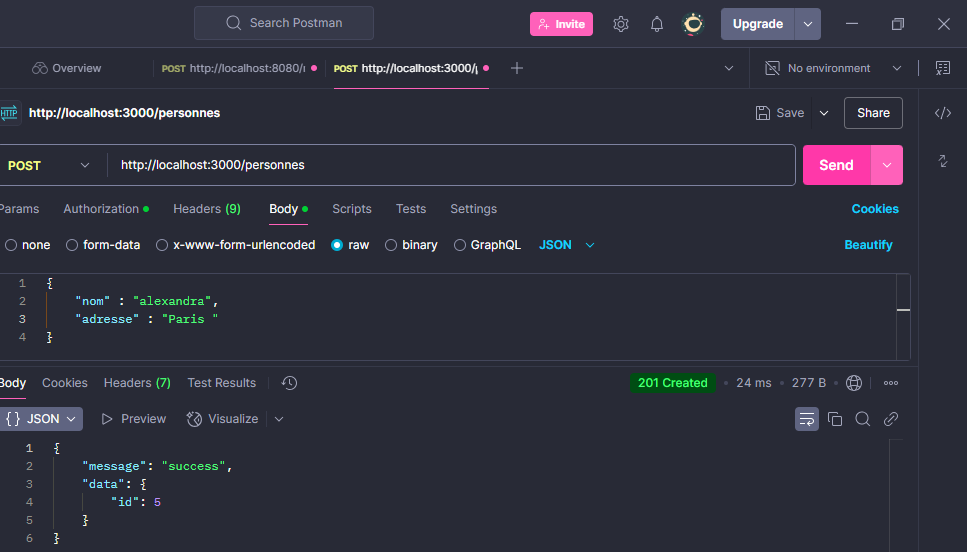
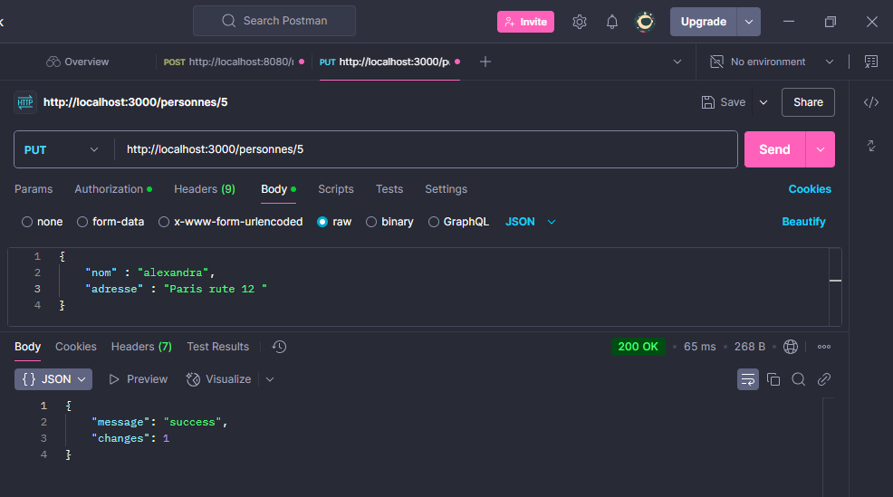
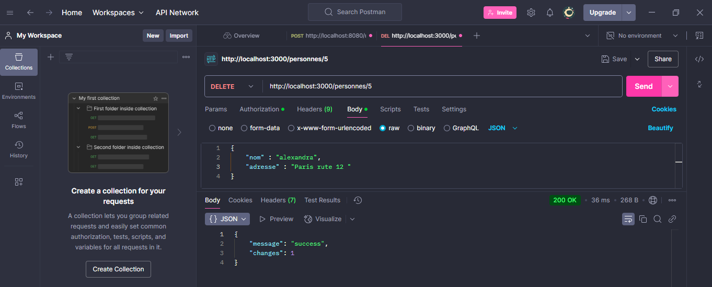


📜 Auteur
👤 Samah Saidi
4Info - Classe DS1
📧 Contact: samah.saidi@polytechnicien.tn
🔗 GitHub: https://github.com/samah-saidi


