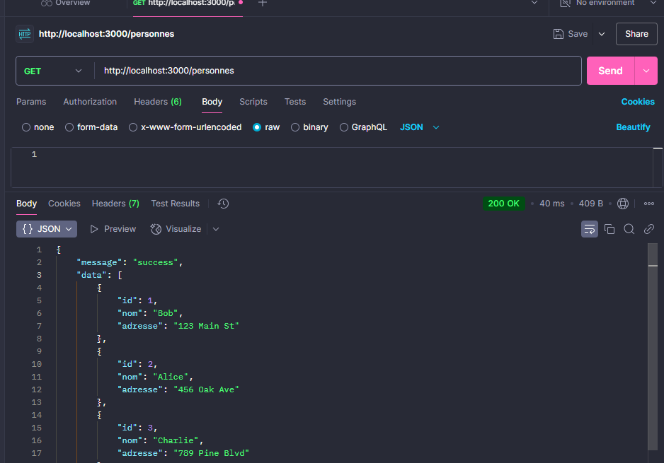

# 📚 TP2 : Création d'une API RESTful avec Express JS

Ce TP a pour objectif de créer une API RESTful en utilisant **Express JS** et **SQLite3**. L'API permet de gérer une base de données de personnes avec des opérations CRUD (Create, Read, Update, Delete). Optionnellement, l'API peut être sécurisée avec **Keycloak** pour l'authentification OAuth 2.0.

---

## 📋 Table des Matières

1. [Objectifs](#objectifs)
2. [Technologies Utilisées](#technologies-utilisées)
3. [Étapes du TP](#étapes-du-tp)
4. [Routes de l'API](#routes-de-lapi)
5. [Tests avec Postman](#tests-avec-postman)
6. [Sécurisation avec Keycloak (Optionnel)](#sécurisation-avec-keycloak-optionnel)
7. [Auteurs](#auteurs)

---

## 🎯 Objectifs

- Créer une API REST avec **Express JS**.
- Utiliser les bonnes pratiques pour les API RESTful.
- Gérer une base de données avec **SQLite3**.
- Optionnel : Sécuriser l'API avec **Keycloak**.

---

## 🛠 Technologies Utilisées

- **Node.js** : Environnement d'exécution JavaScript.
- **Express JS** : Framework pour structurer l'API.
- **SQLite3** : Base de données légère et embarquée.
- **Keycloak** (Optionnel) : Solution d'authentification OAuth 2.0.
- **Postman** : Outil de test des endpoints de l'API.

---

## 🚀 Étapes du TP

### **Étape 1 : Initialisation du Projet**

1. Créez un dossier pour votre projet.
2. Initialisez un projet Node.js :

```bash
   npm init -y
```

3.Installez les dépendances :

```bash
    npm install express sqlite3
```

### **Étape 2 : Configuration de SQLite3**

```bash
    const sqlite3 = require('sqlite3').verbose();

    const db = new sqlite3.Database('./maBaseDeDonnees.sqlite', sqlite3.OPEN_READWRITE | sqlite3.OPEN_CREATE, (err) => {
    if (err) console.error(err.message);
    else {
        console.log('Connecté à la base de données SQLite.');
        db.run(`
        CREATE TABLE IF NOT EXISTS personnes (
            id INTEGER PRIMARY KEY AUTOINCREMENT,
            nom TEXT NOT NULL
        )
        `, (err) => {
        if (err) console.error(err.message);
        else {
            // Insertion de données initiales
            const personnes = ['Bob', 'Alice', 'Charlie'];
            personnes.forEach((nom) => {
            db.run(`INSERT INTO personnes (nom) VALUES (?)`, [nom]);
            });
        }
        });
    }
    });

    module.exports = db;
```


