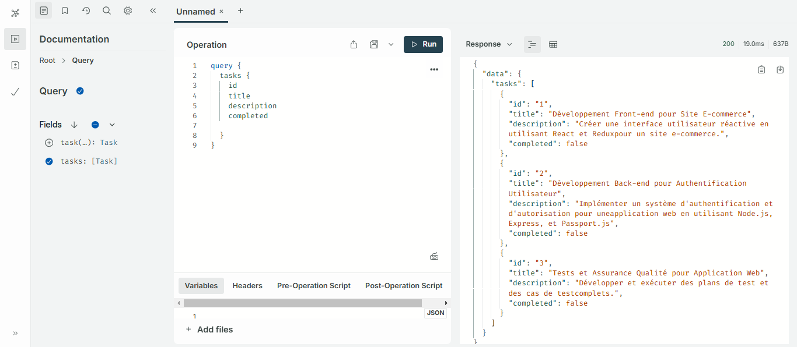
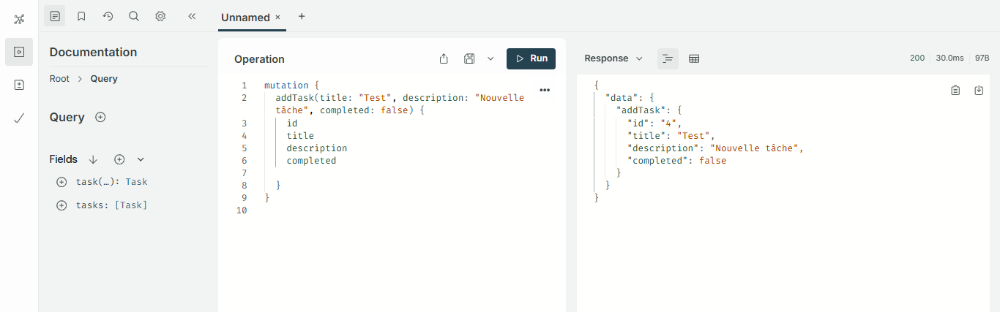
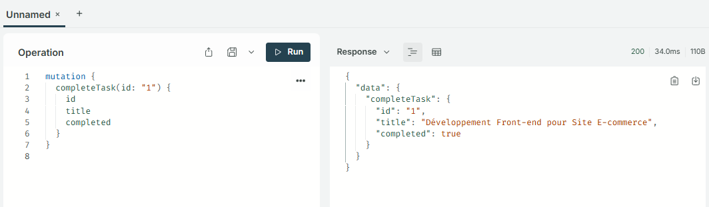
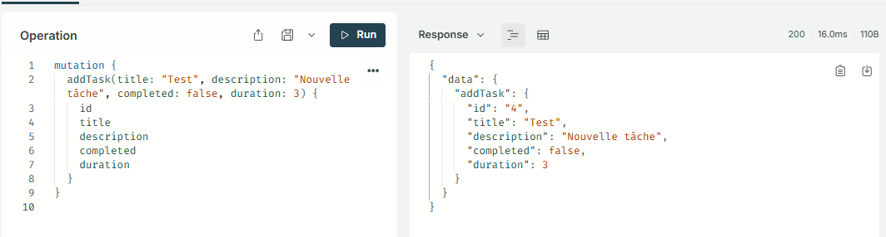
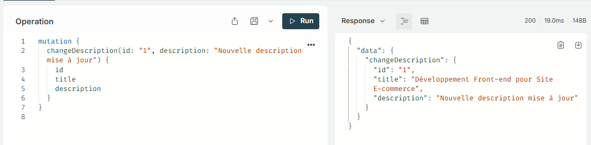
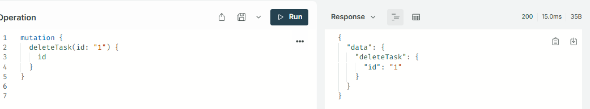

### 📌 TP3 : Système de Gestion de Tâches avec GraphQL

## 🎯 Objectifs

- ⚡ Comprendre et utiliser GraphQL avec Node.js et Express.
- 🛠️ Créer un schéma GraphQL et des résolveurs pour gérer les requêtes et mutations.

## 🛠️ Outils Utilisés

- 🖥️ Node.js
- 🚀 Express
- 🔗 GraphQL
- 🌟 Apollo Server

## 📦 Installation

1. **📥 Installer Node.js** ([Téléchargement](https://nodejs.org/en/download))

2. **📂 Créer un projet et initialiser npm**
   ```sh
   mkdir TP3_graphql && cd TP3_graphql
   npm init -y
   ```
3. **📦 Installer les dépendances**
   ```sh
   npm install express @apollo/server body-parser @graphql-tools/schema graphql
   ```

---

### 📜 Fichiers à créer

#### 1. 📄 `taskSchema.gql`

```graphql
type Task {
  id: ID!
  title: String!
  description: String!
  completed: Boolean!
}

type Query {
  task(id: ID!): Task
  tasks: [Task]
}

type Mutation {
  addTask(title: String!, description: String!, completed: Boolean!): Task
  completeTask(id: ID!): Task
  changeDescription(id: ID!, description: String!): Task
  deleteTask(id: ID!): Task
}
```

#### 2. 📜 `taskSchema.js`

```javascript
const fs = require("fs");
const path = require("path");
const { buildSchema } = require("graphql");
const { promisify } = require("util");
const readFileAsync = promisify(fs.readFile);

async function getTaskSchema() {
  const schemaPath = path.join(__dirname, "taskSchema.gql");
  try {
    const schemaString = await readFileAsync(schemaPath, { encoding: "utf8" });
    return buildSchema(schemaString);
  } catch (error) {
    console.error("❌ Erreur lors de la lecture du fichier schéma :", error);
    throw error;
  }
}

module.exports = getTaskSchema();
```

#### 3. 📜 `taskResolver.js`

```javascript
let tasks = [
  { id: "1", title: "Task 1", description: "Description 1", completed: false },
  { id: "2", title: "Task 2", description: "Description 2", completed: false },
  { id: "3", title: "Task 3", description: "Description 3", completed: false },
];

const taskResolver = {
  Query: {
    task: (_, { id }) => tasks.find((task) => task.id === id),
    tasks: () => tasks,
  },
  Mutation: {
    addTask: (_, { title, description, completed }) => {
      const task = {
        id: String(tasks.length + 1),
        title,
        description,
        completed,
      };
      tasks.push(task);
      return task;
    },
    completeTask: (_, { id }) => {
      const task = tasks.find((task) => task.id === id);
      if (task) task.completed = true;
      return task;
    },
    changeDescription: (_, { id, description }) => {
      const task = tasks.find((task) => task.id === id);
      if (task) task.description = description;
      return task;
    },
    deleteTask: (_, { id }) => {
      tasks = tasks.filter((task) => task.id !== id);
      return { id };
    },
  },
};

module.exports = taskResolver;
```

#### 4. 📜 `index.js`

```javascript
const express = require("express");
const { ApolloServer } = require("@apollo/server");
const { expressMiddleware } = require("@apollo/server/express4");
const { json } = require("body-parser");
const { addResolversToSchema } = require("@graphql-tools/schema");
const taskSchemaPromise = require("./taskSchema");
const taskResolver = require("./taskResolver");

const app = express();

async function setupServer() {
  try {
    const taskSchema = await taskSchemaPromise;
    const schemaWithResolvers = addResolversToSchema({
      schema: taskSchema,
      resolvers: taskResolver,
    });
    const server = new ApolloServer({ schema: schemaWithResolvers });
    await server.start();
    app.use("/graphql", json(), expressMiddleware(server));
    const PORT = 5000;
    app.listen(PORT, () =>
      console.log(
        `🚀 Serveur en cours d'exécution sur : http://localhost:${PORT}/graphql`
      )
    );
  } catch (error) {
    console.error("❌ Échec du démarrage du serveur Apollo :", error);
  }
}

setupServer();
```

---

## 🚀 Utilisation

### ▶️ Lancer le serveur

```sh
node index.js
```

### 🌍 Tester dans Apollo Sandbox

Ouvrir [http://localhost:5000/graphql](http://localhost:5000/graphql)

### 🔍 Exemples de requêtes

#### 📌 Récupérer toutes les tâches

```graphql
query {
  tasks {
    id
    title
    description
    completed
  }
}
```



#### ➕ Ajouter une tâche

```graphql
mutation {
  addTask(
    title: "Nouvelle tâche"
    description: "Description ici"
    completed: false
  ) {
    id
    title
  }
}
```



#### ✅ Marquer une tâche comme terminée

```graphql
mutation {
  completeTask(id: "1") {
    id
    completed
  }
}
```



# ➕ Ajouter au schéma de données une variable duration de type entier et apporter les changements nécessaires.

#### 📌 Récupérer toutes les tâches


#### ➕ Ajouter une tâche



#### ✏️ Modifier la description d'une tâche

```graphql
mutation {
  changeDescription(id: "1", description: "Nouvelle description") {
    id
    description
  }
}
```



#### 🗑️ Supprimer une tâche

```graphql
mutation {
  deleteTask(id: "1") {
    id
  }
}
```



---

---

📜 Auteur
👤 Samah Saidi
4Info - Classe DS1
📧 Contact: samah.saidi@polytechnicien.tn
🔗 GitHub: https://github.com/samah-saidi
