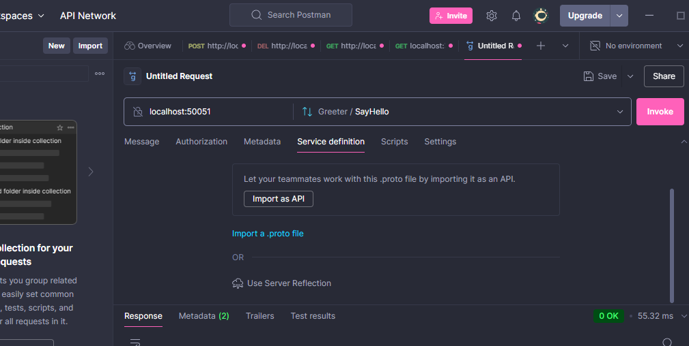

# 🚀 TP4 : Introduction à gRPC

🎯 Objectifs
✔️ Mettre en place un service gRPC pour envoyer et recevoir des requêtes efficacement.
✔️ Créer un reverse proxy pour faciliter la communication avec le service gRPC.

🛠️ Outils utilisés
🔹 Node.js
🔹 gRPC
🔹 protoLoader

🏗️ Étapes d'installation et de configuration

1️⃣ Installation de Node.js

2️⃣ Création du projet

📁 Créez un répertoire et initialisez un projet Node.js :

```bash
mkdir TP4_SOA_gRPC
cd TP4_SOA_gRPC
npm init -y
```

3️⃣ Installation des dépendances
⚙️ Installez les packages nécessaires :

```bash
npm install @grpc/grpc-js @grpc/proto-loader
```

4️⃣ Création du fichier hello.proto
📜 Ajoutez ce contenu au fichier hello.proto :

```proto
    syntax = "proto3";

    package hello;

    service Greeter {
    rpc SayHello (HelloRequest) returns (HelloReply) {}
    }

    message HelloRequest {
    string name = 1;
    }

    message HelloReply {
    string message = 1;
    }
```

5️⃣ Création du serveur gRPC
🖥️ Ajoutez ce code dans server.js :

```js
const grpc = require("@grpc/grpc-js");
const protoLoader = require("@grpc/proto-loader");
const path = require("path");

const PROTO_PATH = path.join(__dirname, "hello.proto");
const packageDefinition = protoLoader.loadSync(PROTO_PATH, {
  keepCase: true,
  longs: String,
  enums: String,
  defaults: true,
  oneofs: true,
});
const helloProto = grpc.loadPackageDefinition(packageDefinition).hello;

function sayHello(call, callback) {
  const { name } = call.request;
  const reply = { message: `Bonjour, ${name} !` };
  callback(null, reply);
}

function main() {
  const server = new grpc.Server();
  server.addService(helloProto.Greeter.service, { SayHello: sayHello });
  const port = "0.0.0.0:50051";
  server.bindAsync(port, grpc.ServerCredentials.createInsecure(), () => {
    console.log(`🚀 Serveur gRPC démarré sur ${port}`);
  });
}

main();
```

6️⃣ Lancer le serveur
Démarrez le serveur avec :

```bash
node server.js
```

✅ Si tout fonctionne, vous verrez :

```bash
🚀 Serveur gRPC démarré sur 0.0.0.0:50051
```

7️⃣ Test avec Postman
📡 Pour tester le service gRPC avec Postman :

Créer une nouvelle requête gRPC : New → gRPC Request
Indiquer l’hôte : localhost:50051
Importer hello.proto
Sélectionner le service Greeter et la méthode SayHello
Envoyer un JSON avec :


📜 Auteur
👤 Samah Saidi
4Info - Classe DS1
📧 Contact: samah.saidi@polytechnicien.tn
🔗 GitHub: https://github.com/samah-saidi
